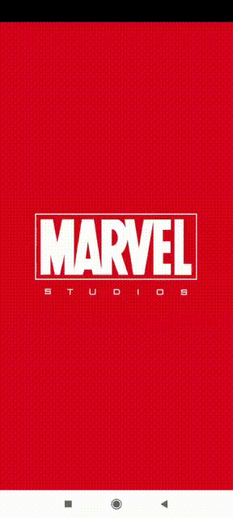

# Marvel Application
_Application that shows the list of heroes and their characteristics. It also shows the list of series and comics where these heroes have appeared. This application is made based on the Marvel API using Retrofit._
_It also includes a quiz game about the characters, as well as a downloadable chronology of how to watch the Marvel movies in the correct order._
 
 ## Use
 _Prerequisites: You must obtain valid Marvel Keys to use this library. You can get it from [Marvel] marvelAuthorization._
 

 -------------------------------------------------------------------------------------------------------------------------------------------------------------------------------

 # Project preview
 
 *Splash* | *List of characters* | *Character details* |
  ------- | -------------------- |  ------------------ |
 |  | 
 
  *Timeline and Quiz* | *Search of characters* |
  ------------------- | ---------------------- |
 | 

 
 ## Tools
 _Libraries used in this project_
 
* [OkHttp okHttp]
* [Rtrofit retrofit]
* [JUnit junit]
* [Glide]

 
 -------------------------------------------------------------------------------------------------------------------------------------------------------------------------------
 # License
 
Copyright 2021 Lidia Parral

Licensed under the Apache License, Version 2.0 (the "License");
you may not use this file except in compliance with the License.
You may obtain a copy of the License at

   http://www.apache.org/licenses/LICENSE-2.0

Unless required by applicable law or agreed to in writing, software
distributed under the License is distributed on an "AS IS" BASIS,
WITHOUT WARRANTIES OR CONDITIONS OF ANY KIND, either express or implied.
See the License for the specific language governing permissions and
limitations under the License.

Data provided by Marvel. © 2014 Marvel
